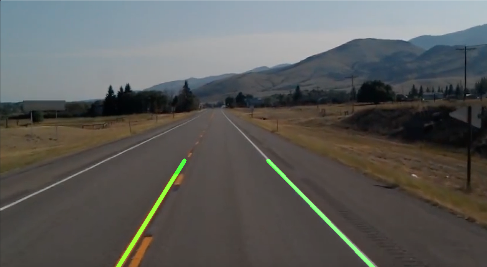
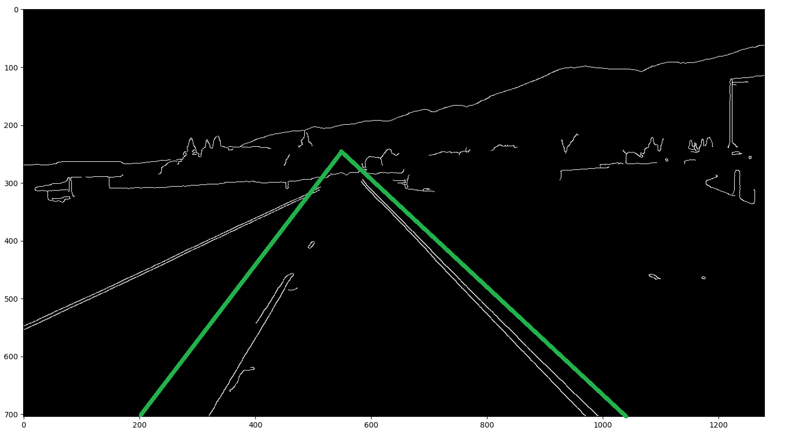
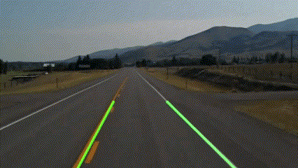

# Lane Detection using OpenCV

## Overview

This project is a lane detection program that uses OpenCV to detect and draw the lanes on the road in an image or video. The program works by performing the following steps:

- Convert the image to grayscale.
- Apply Gaussian blur to smooth the image.
- Detect edges using the Canny edge detection algorithm.
- Select a region of interest (ROI) by masking the image.
- Use the Hough transform to detect lines in the image. [See more about Hough Transform](https://docs.opencv.org/3.4/d9/db0/tutorial_hough_lines.html)
- Group the lines into left and right lanes based on their slopes.
- Average the slope and intercept of each group to obtain a single line for each lane.
- Draw the lanes on the image by extrapolating the lines to the bottom and top of the ROI.

## Usage

Run `main.py`. Program is in video capture mode. To detect lane from image, you should uncomment the commented section.

## Requirements

The project requires Python 3.6 or above and listed libraries:

- opencv
- numpy

### Author

- LinkedIn - [Ömer Fatih Bülbül](https://www.linkedin.com/in/ömer-fatih-bülbül-74a890236/)
- Twitter - [fatihbulbul91](https://twitter.com/fatihbulbul91)
